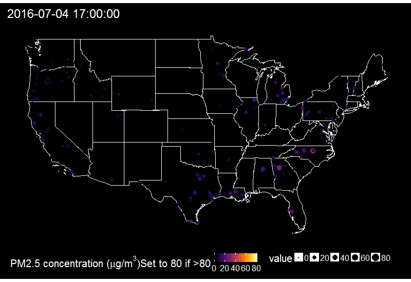

```{r setup, include=FALSE}
knitr::opts_chunk$set(echo = FALSE,
                      warning = FALSE,
                      message = FALSE, 
                      cache = TRUE)
library("ggplot2")
library("ggmap")
library("viridis")
library("ggthemes")
library("ggrepel")
library("dplyr")
library("gganimate")
library("animation")
theme_set(theme_bw(base_size = 22))
```

# Intro: who am I

## Who am I?

* BSc Biology, MSc Ecology, MPH, PhD in statistics

* Data manager and statistician for the CHAI project


* An open-data and open-source enthusiaste

## What I am NOT

Christa said I was an "OpenAQ data wrangler extraordinaire"... LIES!

But I like to wrangle OpenAQ extraordinary data!

# Why wanting to get OpenAQ data?

## {data-background="https://media.giphy.com/media/kkpcRessCvNyo/giphy.gif"}

# A treasure from New Zealand

## {data-background="https://media.giphy.com/media/MHTCPUVHs3I3e/giphy.gif"}

## {data-background="figs/kiwi.jpg"}

## No! R!


Language for statistical computing

## R capabilities

* Data wrangling, modeling, visualization

* Reporting, interactive plots and apps

* Collaborative effort like Wikipedia

# Bringing OpenAQ to R!

## What is a package? {data-background="https://media.giphy.com/media/exC1tT30Q4JRm/source.gif"}

## What is a package?

* An add-in to R

* A collection of code and documentation


## ropenaq {data-background-iframe="http://ropensci.github.io/ropenaq/index.html"}

## ropenaq

```r
library("purrr")
library("dplyr")
library("ropenaq")
count <- aq_measurements(city = "Sarajevo", 
                         country = "BA")
count <- attr(count, "meta")$found

sarajevo <- 1:(ceiling(count/10000)) %>%
  map(function(page){
    aq_measurements(city = "Sarajevo", 
                    country = "BA",
                    limit = 10000,
                    page = page)
  }) %>%
  bind_rows()

```

## Quality control

* Review of the software

* Improvement for robustness and ease of use

* Part of an open science project!


# Some wrangling cases

## Map of all OpenAQ locations


```{r}
library("rworldmap")
load("data/openaq_locations.RData")
worldMap <- map_data(map="world")

gg <- ggplot() + geom_map(data=worldMap, map=worldMap,
                          aes(map_id=region, x=long, y=lat),
                          fill = "grey60")

plotMap <- gg +
  geom_point(data = dataGeo, aes(x=longitude, y=latitude), size=1, col = "darkblue")+
  theme_map()
print(plotMap)

```

## Delhi PM2.5 daily time series

```{r delhi hourly, fig.width = 10, fig.height = 6}
load("data/meas_india.RData")

table <- both %>% mutate(day = as.Date(dateLocal)) %>%
  filter(value > 0, value != 1985) %>%
  group_by(day, location) %>%
  summarize(PM25 = mean(value)) %>%
  ungroup()

 ggplot() +
  geom_line(data = table, aes(x = day,y = PM25), col = "darkblue")+
  ylab(expression(paste("PM2.5 concentration (", mu, "g/",m^3,")")))+
   xlab("Time (days)")
```

## vs. Indian health categories


```{r delhi daily, fig.width = 10, fig.height = 6}


paletteAQI <- viridis::viridis_pal(option = "plasma")(6)
paletteAQI2 <- factor(paletteAQI,
                     levels = paletteAQI)
labels <- factor(c( "Good", "Satisfactory", "Moderately polluted",
                    "Poor", "Very Poor", "Severe"),
                 levels = c( "Good", "Satisfactory", "Moderately polluted",
                             "Poor", "Very Poor", "Severe"))

aqiPM <- data.frame(ymin = c(0, 30, 60, 90, 120, 250),
                    ymax = c(30, 60, 90, 120, 250, Inf),
                    col = paletteAQI2)


ggplot() +
  geom_rect(data = aqiPM, aes(xmin = table$day[1], xmax = max(table$day),
                              ymin = ymin, ymax = ymax,
                              fill = col), alpha = 0.7)  +
  scale_fill_manual(name="AQI Category PM.5",
                      breaks=paletteAQI,
                      values=paletteAQI,
                      labels=labels)+
  geom_line(data = table, aes(x = day,y = PM25))+
  ylab(expression(paste("PM2.5 concentration (", mu, "g/",m^3,")")))+
   xlab("Time (days)") +
  theme(legend.position = "bottom")

```

## Delhi PM2.5 vs. WHO limit

```{r delhi daily who, fig.width = 10, fig.height = 6}

ggplot() +
  geom_line(data = table, aes(x = day,y = PM25), 
             col = "darkblue")+
  geom_hline(yintercept = 25, size = 1.2, col = "darkred") +
  ylab(expression(paste("PM2.5 concentration (", mu, "g/",m^3,")")))+
   xlab("Time (days)") 
```


## Sarajevo PM10 stations

```{r}
sarajevo <- readr::read_csv("data/sarajevo.csv")
daily <- filter(sarajevo, parameter == "pm10") %>%
  group_by(location, longitude, latitude, day = as.Date(dateLocal)) %>%
  summarize(pm10 = mean(value)) %>%
  group_by(day) %>%
  filter(all(!is.na(pm10))) %>%
  ungroup() %>%
  filter(location != "Ivan Sedlo")

map_data <- unique(select(daily, longitude,
                          latitude, location))
```

```{r}
sarajevo_map <- get_map(location = "Sarajevo Bosnia",
                        zoom = 12)


ggmap(sarajevo_map) +
  theme_map() +
  geom_point(data = map_data,
             aes(longitude,
                 latitude),
             size = 4) +
  geom_label_repel(data = map_data,
                   aes(longitude,
                       latitude,
                       label = location),
                   size = 10)
```

## WHO daily limit, PM10 in Sarajevo

```{r}
ggplot(daily) +
  geom_line(aes(day, pm10)) +
  facet_grid(location  ~ .) +
  geom_hline(yintercept = 50, col = "red") +
  ylab(expression(paste("Daily mean PM10 concentration (", mu, "g/",m^3,")"))) + 
  xlab("Time (days)") +
  theme(strip.text.y = element_text(angle = 0))
```

## Coyhaique vs. Ulaanbaatar

```{r}
load("data/cities.RData")
cities <- ungroup(cities)
cities <- filter(cities, location != "Coyhaique II")
cities <- filter(cities, pm25>0)
cities <- mutate(cities, location = ifelse(grepl("Ula", location), "Ulaanbaatar", location))
 ggplot(cities) +
  geom_line(aes(x = day,y = pm25), col = "darkblue")+
  ylab(expression(paste("PM2.5 concentration (", mu, "g/",m^3,")")))+
   xlab("Time (days)") +
  facet_grid(location  ~ .) +
  theme(strip.text.y = element_text(angle = 0))
  

```


```{r fireworks, cache = TRUE}
load( "data/4th_july.RData")

mintime <- lubridate::ymd_hms("2016 07 04 17 00 00")
maxtime <- lubridate::ymd_hms("2016 07 05 07 00 00")

measurements <- filter(measurements, 
                       hour >= mintime)
measurements <- filter(measurements, 
                       hour <= maxtime)

library("albersusa")
us <- usa_composite()
us_map <- fortify(us, region="name")
us_map <- filter(us_map, !id %in% c("Alaska", "Hawaii"))
gg <- ggplot()
gg <- gg + geom_map(data=us_map, map=us_map,
                    aes(x=long, y=lat, map_id=id),
                    color="white", size=0.1, fill="black")
gg <- gg + theme_map(base_size = 20)
gg <- gg + theme(plot.title = element_text(color="white"))
gg <- gg + theme(legend.position
                 = "bottom")
gg <- gg + theme(panel.background = element_rect(fill = "black"))
gg <- gg + theme(plot.background=element_rect(fill="black"))
gg <- gg + theme(legend.background= element_rect(fill="black", colour= NA)) 
gg <- gg + theme(legend.text = element_text(colour="white"))
gg <- gg + theme(legend.title = element_text(colour="white"))


lala <- group_by(measurements, location, latitude) %>% summarize(n = n())

measurements <- group_by(measurements, location, latitude) %>%
  filter(n() == max(lala$n),
         latitude < 50, longitude > - 130) %>%
  ungroup()

minConc <- min(measurements$value, na.rm = TRUE)
maxConc <- max(measurements$value, na.rm = TRUE)
plotMap <- gg+
  geom_point(data = measurements, aes(x=longitude,
                                      y=latitude,
                                      frame=as.character(hour),
                                      colour = value,
                                      size = value))+
  coord_map()+
  viridis::scale_color_viridis(expression(paste("PM2.5 concentration (", mu, "g/",m^3,")Set to 80 if >80")),
                               option = "inferno") 
 

ani.options(interval = 0.5, ani.width = 800, ani.height = 550)

gg_animate(plotMap, "figs/fireworks.gif")
```
## Fireworks 4th of July via PM2.5




# What can you do?

## Learn R! {data-background="https://media.giphy.com/media/WkOREwvEGybao/giphy.gif"}

## How to learn R

* Datacamp, Coursera

* Hadley Wickham's books

* Online tutorials

## How to contribute to ropenaq

* Report bugs!

* Help build the documentation.

* Show me examples of figures, for adding how-to in the documentation.

## Thank you! {data-background="https://media.giphy.com/media/LGsfQE3YrHS2k/giphy.gif"}
